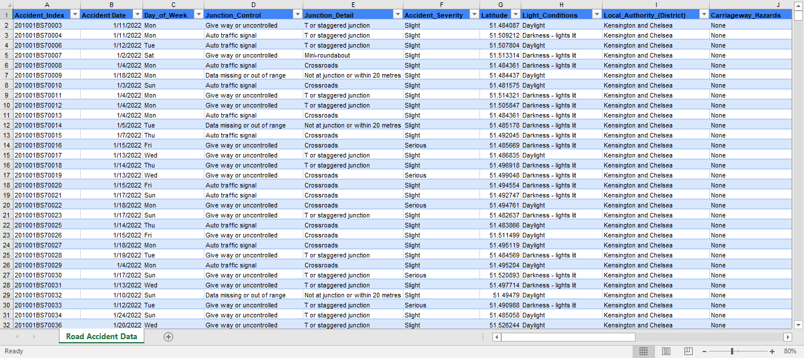
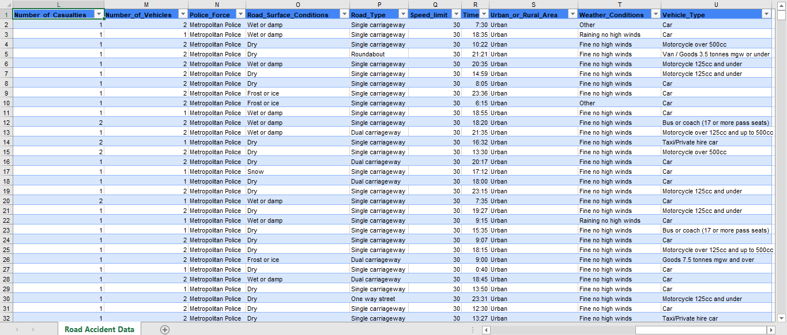
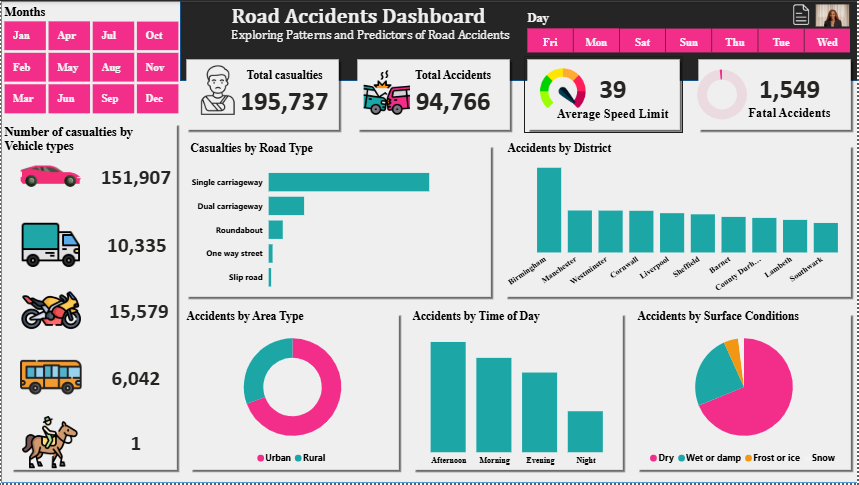
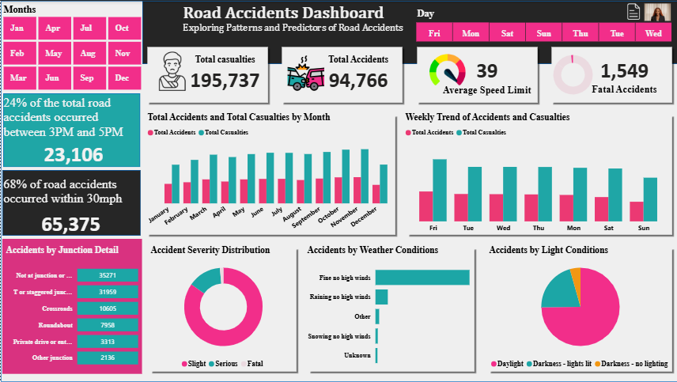
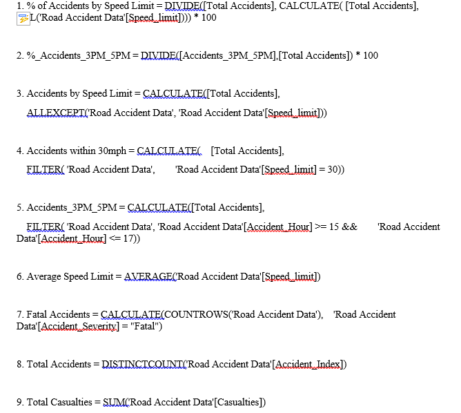

# Road-Accident-Analysis
Road traffic accidents remain a major public safety concern, leading to loss of lives, injuries, and economic impact. This project analyzes road accident data to uncover patterns, trends, and contributing factors behind accidents and casualties.  

**Business Problem**

Road safety authorities need a clear understanding of:

- When road accidents occur most frequently

- Where accidents are most concentrated

- What conditions contribute to higher accident severity

- How casualties differ by vehicle type, road type, and environment

- Without clear insights, it becomes difficult to design effective safety policies, speed regulations, and infrastructure improvements.

**Objectives**

This project aims to:

- Analyze accident and casualty trends over time

- Identify high-risk periods, locations, and conditions

- Examine accident severity and contributing factors

- Provide actionable insights to improve road safety strategies

**Dataset Overview**

Data Source: Road accident records

Coverage: Multiple locations and time periods

**Key Metrics**: Accidents, casualties, fatalities, speed limits, road types, weather, lighting, and surface conditions

**Key Features in the Dashboard**

**KPI Metrics**

- Total Casualties: 195,737

- Total Accidents: 94,766

- Fatal Accidents: 1,549

- Average Speed Limit: 39 mph

**Dashboard Analysis**

**Accident Trends**

- Monthly and weekly trends show how accidents and casualties vary across time

- Peak accident periods are clearly highlighted to identify high-risk timeframes

**Time of Day Insights**

- A significant share of accidents occurred between 3 PM and 5 PM, indicating higher risk during peak traffic hours

**Speed & Severity**

- 68% of accidents occurred within 30 mph zones, highlighting the importance of speed enforcement even at lower limits

**Vehicle Type Analysis**

- Cars account for the highest number of casualties

- Trucks, motorcycles, buses, and other vehicles contribute varying levels of risk

**Road & Area Type**

- Single carriageways record the highest number of accidents

- Urban areas experience more accidents compared to rural areas

**Environmental Factors**

- Most accidents occur in dry road conditions, suggesting driver behavior plays a significant role

- Daylight conditions still record a high number of accidents, indicating visibility alone does not eliminate risk

**Visualizations**
Main Dashboard View

Detailed Analysis View

**Tools & Technologies Used**

Power BI – Data modeling, DAX measures, and interactive dashboard creation

DAX – Calculated measures for KPIs and trends

Data Cleaning & Transformation – Ensured accurate and consistent data for analysis

**Key Insights**

- Afternoon and evening periods have the highest accident frequency

- Urban areas experience more accidents, likely due to higher traffic density

- Cars contribute the largest share of casualties

- Speed regulation zones alone are not enough to prevent accidents

- Environmental conditions play a role, but human behavior remains a major factor

**Recommendations**

- Strengthen traffic monitoring during peak hours (especially 3 PM – 5 PM)

- Improve road safety awareness campaigns in urban areas

- Enforce speed limits more effectively, even in lower-speed zones

- Enhance road design and signage on high-risk road types

- Combine infrastructure improvements with behavioral safety programs

**Limitations**

Dataset does not include driver demographics or behavioral data

External factors such as vehicle condition and driver experience were not available

Findings represent historical data and may not capture recent changes

**Conclusion**

This analysis transforms raw road accident data into meaningful insights that highlight risk factors, trends, and safety gaps. The dashboard provides stakeholders with a clear, interactive tool to monitor accidents, understand contributing factors, and support data-driven road safety initiatives.
